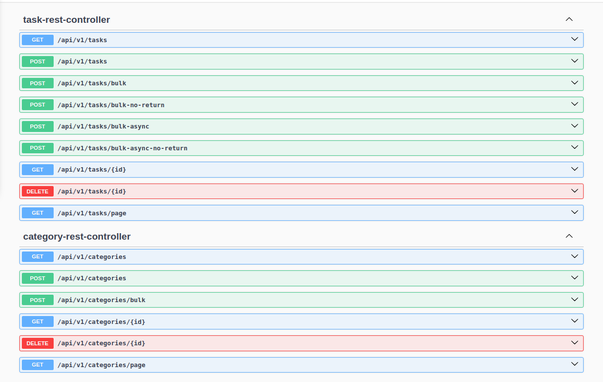

# Tasks Management System Demo

## Overview
This is a demo for a task management system showing some use cases as follows:
* Create a task or a bunch of tasks
* Get the tasks with and without pagination
* Delete a task
* Do the operations above for the category of tasks.

## How to run
* You can run the app either using Docker or locally using the following commands
* Docker
  * Install Maven & run "mvn clean package -DskipTest"
  * docker-compose up
* Locally
  * Install Java 21, Maven, and PostgreSQL & create your tickets database.
  * Run "mvn clean package -DskipTest"
  * Run "java -jar -Dspring.profiles.active=local target/tickets.jar" from the project root directory.
 
## Used Technologies:
* Java
* Spring Boot
* Docker & Docker Compose
* Maven
* JWT for the security Purposes
* Postgres

## API Documentation

